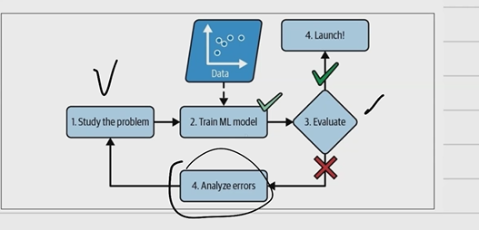
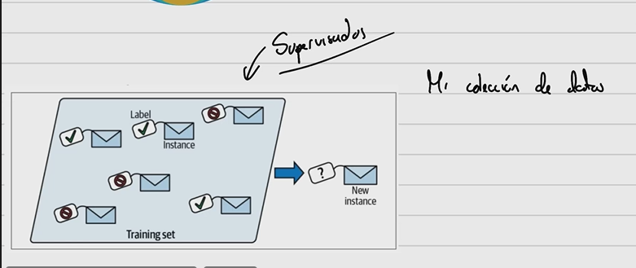
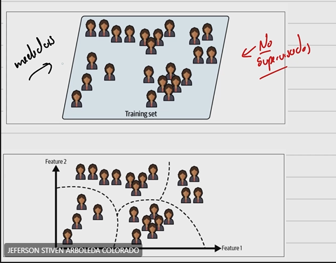

## Seguimiento de Experimentos con MLflow

**¿Qué es ML?** 

Campo de estudio -> que da la habilidad a los computadores de "aprender" sin ser explicitamente programado.

**¿Qué son modelos supervisados?**

A partir de mi colección de datos. Por ejemplo, un experimento donde mido diferentes variables (como peso y altura de estudiantes). Ademas, tomo la talla de sus zapatos. Mi $x$ seran peso y altura. Mi $y$ sera la talla del zapato. 

**¿Qué son modelos NO supervisados?**

No tengo una etiqueta. Pero si tengo las medidas. 

**Entonces, ¿Qué se busca?**

Bucar patrones. Encontrar clusters (aglomeraciones?)

Tenemos unas necesidades para evaluar si los datos se acomodan a lo que requiere el proyecto tambien el rendimiento del modelo.

Es común encontrarse con pocos datos. Los cuales no son suficientes para aprender las particularidades suficientes. 

**Overfitting y Underfitting**

Underfitting -> Modelo no se adapta bien -> Train

No generaliza bien

Overfitting -> No generaliza bien

Nombres asignados a las columnas -> Atributos, caracteristicas.

**Parametros->** En el modelo
**Hiperparametros->** En el algoritmo

Parámetros:

Los parámetros son valores internos que el modelo aprende durante el proceso de entrenamiento a partir de los datos.
Estos valores son ajustados de manera iterativa para que el modelo pueda realizar predicciones precisas.
Los parámetros son específicos del modelo y de la tarea. Por ejemplo, en una red neuronal, los pesos y sesgos de las conexiones entre las neuronas son parámetros.
Los parámetros se derivan directamente de los datos de entrenamiento y se utilizan para realizar inferencias o predicciones en datos nuevos.
Hiperparámetros:

Los hiperparámetros son configuraciones predefinidas que se establecen antes del entrenamiento del modelo y que controlan aspectos del proceso de entrenamiento en sí, así como la arquitectura del modelo.
Los hiperparámetros no son aprendidos por el modelo, pero afectan cómo se realizan las actualizaciones de los parámetros durante el entrenamiento.
Ejemplos comunes de hiperparámetros incluyen la tasa de aprendizaje, el número de capas ocultas en una red neuronal, el número de árboles en un bosque aleatorio, la profundidad máxima de un árbol de decisión, etc.
A menudo, se requiere ajustar los hiperparámetros para optimizar el rendimiento del modelo en una tarea específica.
En resumen, los parámetros son valores internos del modelo que se aprenden a partir de los datos, mientras que los hiperparámetros son configuraciones externas que se definen antes del entrenamiento y afectan cómo se realiza el proceso de aprendizaje. El ajuste adecuado de los hiperparámetros es esencial para obtener un modelo de aprendizaje automático efectivo.

### MlFlow

Ejemplo con una regresión lineal. Donde vamos a dividir los datos en entrenamiento y prueba. Y vamos:

- Medir métricas
- Obtener los parámetros
- Obtener el modelo como tal

Se escribe un codigo y vemos como queda reflejado en mlflow

# Resumen de read.ia

 

 

 

# Actividad  

 

 

 